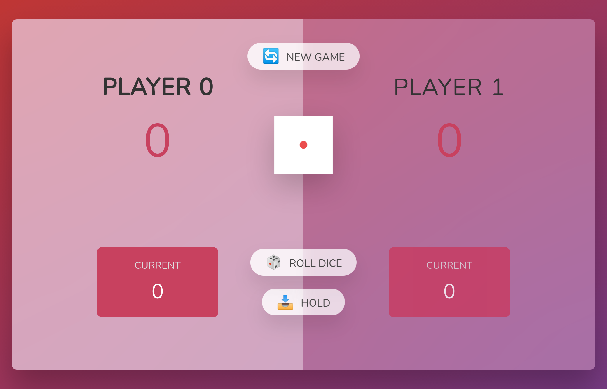
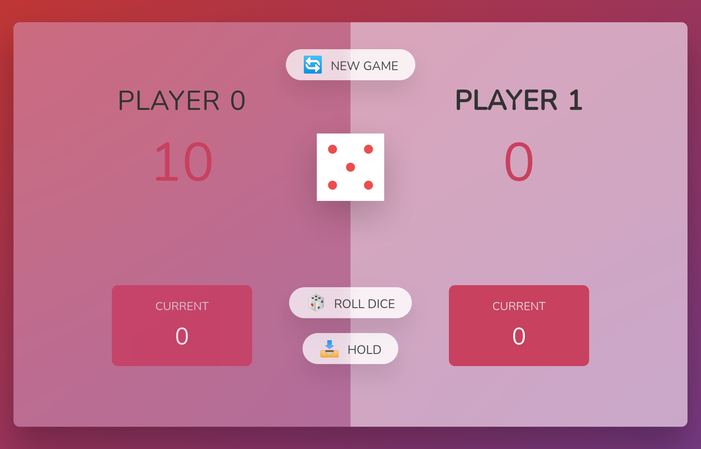

# PIG GAME with ReactJS, React Hooks

This is a small game created with _Create React App_.

## Table of contents

- [Overview](#overview)
  - [Links](#links)
  - [The challenge](#the-challenge)
  - [Screenshot](#screenshot)
- [My process](#my-process)
  - [Built with](#built-with)
- [Author](#author)
- [Acknowledgments](#acknowledgments)

## Overview

### Links

- Solution URL: [SOURCE PROJECT](https://github.com/waltersono/pig-game-with-react)
- Live Site URL: [LIVE DEMO](https://waltersono.github.io/pig-game-with-react/)

### The challenge

The app should be able to:

- Allow users to roll dice
- Allow users to hold a score
- Allow users to restart the game
- Increase users total score based on dice number
- Show who won the game

### Screenshot

## My process

### Built with

- [React](https://reactjs.org/) - JS library
- Create React App
- React useReducer
- Semantic HTML5 markup

## Author

- LinkedIn - [Walter Sono](https://www.linkedin,com/in/waltersono.com)

## Acknowledgments

Want to give credit to [Jonas](https://jonas.io/) for the elegant css design of this game, without him the game would not be as attractive as it is.
